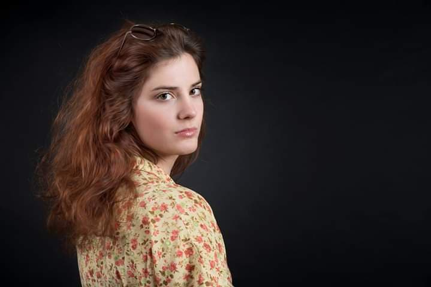

# Julie Lagnier

Julie a été attirée par l'écriture dès son plus jeune âge, le merveilleux des mots, leurs pouvoirs. Ayant reçu plusieurs prix littéraires dont celui de la nouvelle nationale et internationale, elle ne cesse jamais d'écrire, de se questionner à travers les mots et d'inviter l'autre à franchir les frontières pour passer d'un univers à l'autre.

Formée en tant que danseuse et chanteuse puis comédienne au conservatoire de Bordeaux, elle aime croiser les arts, qu'ils se répondent, se complètent, se nourrissent, s'apportent les uns les autres. Elle a déjà participé à plusieurs collaborations avec des musiciens, quatuor de musique de chambre ou orchestres symphoniques liés à des lectures invitant au fantastique.

Julie aime voyager, aller à la découverte d'autres cultures, d'autres personnalités, humanités et de toutes formes d'art différent du standard européen qui nous est connu. Au sortir de sa formation elle enchaîne avec des spectacles pour enfants, public fascinant, vivant et vivace que l'on peut inviter à monter au plateau pour s'y exprimer, s'y libérer. Elle est en tournée depuis deux ans à travers la France entière suite au succès de la pièce de boulevard, "Quelle famille ! " de Francis Joffo avec l'adorable Armelle et Jean-Pierre Castaldi, pièce invitant au rire, à s'échapper du quotidien, le temps d'une respiration. "Il ne reste plus qu'à continuer à vivre et créer, toujours. Aux bonheurs des nouvelles rencontres et inspirations...

Quel sera le prochain rendez-vous ?"
