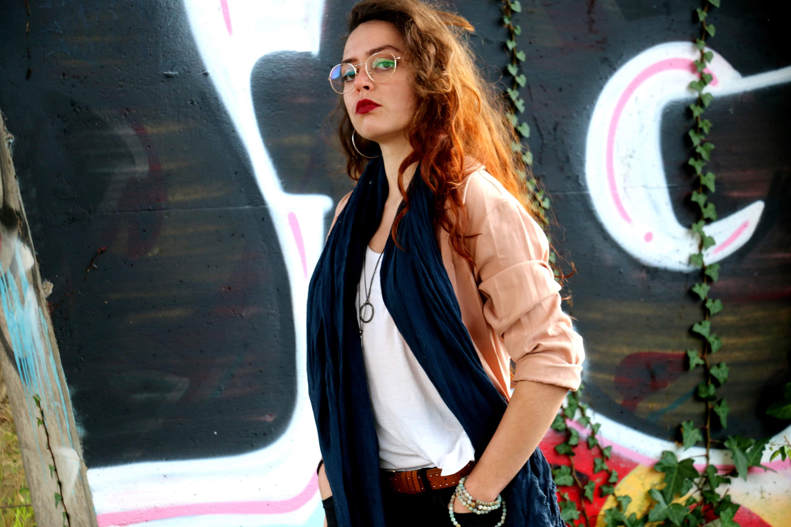

# Laura Vélia

---

Formée au Théâtre école d’aquitaine et au conservatoire de Bordeaux, c’est au travers de ces formations que Laura récolte un maximum de cordes pour son arc de jeune comédienne. Tantôt danseuse, chanteuse, meneuse de revue, chorégraphe, musicienne, metteur en scène, auteur, prof de théâtre. Elle se diversifie toujours et utilise tous les outils qu’elle a pu croiser pour appuyer les nouveaux projets qu’elle démarre.

On a pu voir Laura dans des pièces classiques, On ne Badine Pas Avec l’Amour de Musset, ou des spectacles pour enfants dans lesquels elle a pu mettre à profit ses talents de clarinettiste ou de danceuse en ombre chinoise. Formée par Pierre Debauche, poète aux sensations insolentes, c’est tout naturellement qu’elle continue ce qu’il lui a inculqué avec ses propres envies de création, pour rassembler, questionner ensemble, continuer d’être débutante tout au long de sa vie.

Avec le corps comme outils principal de partage de sensations, Laura restera une machine à produire du souffle tant que le public sera là pour le recevoir.
